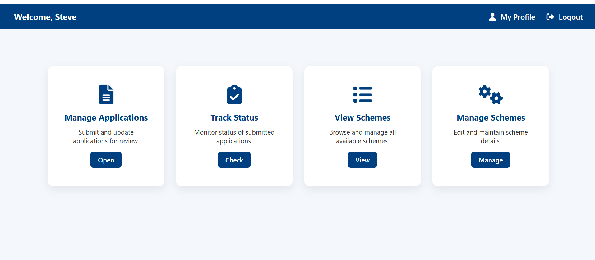
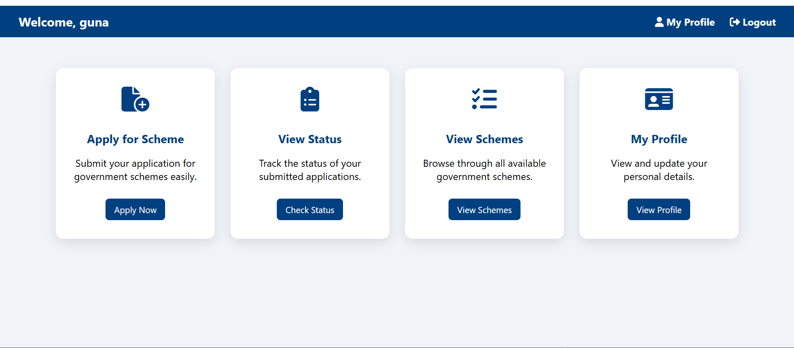
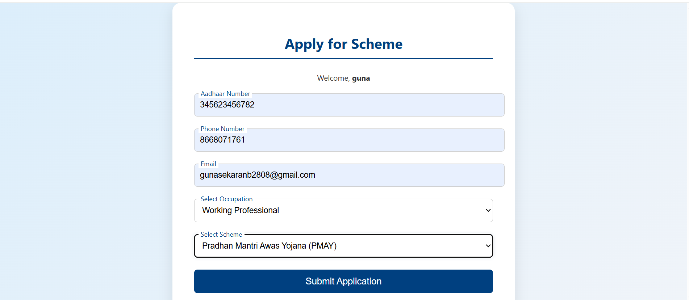
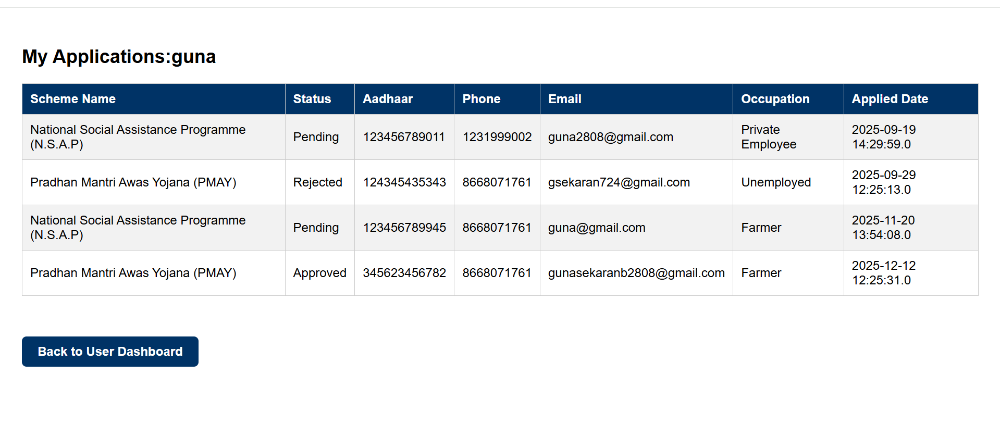

# Government Scheme Portal (JSP & JDBC)

A web-based Government Scheme Management System developed using **JSP, JDBC, MySQL**, and **Apache Tomcat**.

## 🔹 Features

### User Module
- User Registration & Login
- View available government schemes
- Apply for schemes
- Track application status
- Edit user profile

### Admin Module
- Admin login
- Add / Edit / Delete schemes
- View user applications
- Approve / Reject applications
- Manage admin profile

## 🔹 Technologies Used
- Frontend: HTML, CSS, JSP
- Backend: Java (JDBC)
- Database: MySQL
- Server: Apache Tomcat
- IDE: NetBeans

## 🔹 Database Design
- users
- admins
- schemes
- applications

## 🔹 How to Run
1. Import project into NetBeans
2. Configure MySQL database
3. Update DB credentials in JSP files
4. Deploy on Apache Tomcat
5. Run `index.jsp`
6. 
## 🔹 Screenshots
🔐 Login Page
.png)
🛠️ Admin Dashboard

👤 User Dashboard

📝 Apply Scheme Page

📄 Application Status Page

## 🔹 Author
**Gunasekaran (Guna)**
